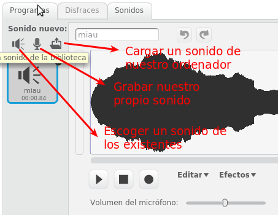
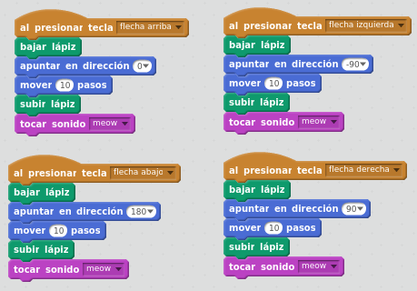

# Lápiz y Sonido

Los bloques de **Lápiz** sirven para dejar una estela por donde el objeto se mueva. Para que deje la estela dibujada, es necesario añadir el bloque "bajar lápiz" previamente al movimiento. Cuando terminemos de pintar, habrá que poner el bloque de "subir lápiz" para que al volver a mover el objeto ya no pinte. Será posible pintar con distintos colores y grosores. El bloque "borrar" sirve para borrar todo lo pintado. Podemos poner un Programa que al darle a la tecla "b" borre todo. Puedes probar a poner estos bloques para que veas su efecto:

Los bloques de **Sonido** sirven para reproducir sonidos en algún momento de nuestro programa. Cada objeto viene con un sonido predeterminado. Pero nosotros mismos podemos grabar o añadir música que ya tengamos en nuestro ordenador:

## Caso práctico

Haz un programa que muestre el camino por donde se ha movido el gato. Añade que suene un "miau" después de haber pintado la línea.

<input type="button" name="toggle-feedback-quesFeedback0b134" value="Mostrar retroalimentación" class="feedbackbutton" onclick="$exe.toggleFeedback(this,true);return false" />

### Retroalimentación

